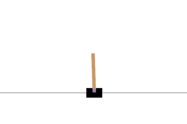

# rlens

[](https://github.com/can2erol/rlens/actions/workflows/ci.yml)
[](https://www.python.org/downloads/)
[](LICENSE)

An **observability-first** reinforcement-learning training & benchmarking library, built on
PyTorch and Gymnasium. The headline feature is *visibility*: a local web dashboard that
streams reward curves, per-layer gradient norms, action/value distributions, and rollout
video — live, while you train — and overlays multiple runs for benchmarking.



*A PPO policy balancing CartPole-v1 after ~60k steps. Regenerate with
`python scripts/make_demo_gif.py`.*

> Designed and tested on Apple Silicon (M-series, MPS). No CUDA required.
> **Status:** early/alpha — the API may still change.

## Install

```bash
python3.12 -m venv .venv
source .venv/bin/activate
pip install -e ".[dev]"

# optional: Box2D envs (LunarLander, BipedalWalker) — needs a compiler/swig
pip install -e ".[dev,box2d]"
```

## Quickstart

```bash
# train a policy (writes telemetry to ./runs/<run-name>)
rlens train --algo ppo --env CartPole-v1

# in another terminal, watch it learn
rlens dashboard         # open http://127.0.0.1:8000

# score a trained policy and record a rollout video
rlens eval runs/<run-name> --episodes 10 --video

# benchmark a grid of algo x env x seed
rlens bench configs/bench.yaml
```

## Dashboard

`rlens dashboard` serves a live, no-build web UI (open http://127.0.0.1:8000) that tails the
run directories — attach to a live run, a finished one, or a whole benchmark grid:

- **Reward curves** for any logged metric, **overlaying multiple runs** with EMA **smoothing**
  and a **step ↔ wall-time** x-axis toggle.
- A **run-comparison table** (sortable: best/last return, eval, steps, FPS, status) so a grid
  is one glance, not twelve tabs.
- A **config panel** showing exactly which hyperparameters produced a curve — with a
  **diff mode** that highlights what changed across the selected runs.
- Auto-captured **gradient norms**, **action distributions**, and inline **rollout video**.

It reads the same SQLite stores the trainer writes (WAL mode → safe concurrent reads), so the
dashboard is fully decoupled from training.

## Evaluation

Training returns mix in exploration (epsilon-greedy, stochastic sampling), so they
undersell a policy. `rlens eval` loads a run's `policy.pt` and scores it greedily:

```bash
rlens eval runs/ppo-CartPole-v1-s0-20260619  # mean ± std return over 10 episodes
rlens eval runs/<name> --episodes 20 --video # also writes videos/eval.mp4
rlens eval runs/<name> --stochastic          # sample actions instead of greedy
rlens eval runs/<name> --best                # score the best-eval checkpoint
```

To track a clean eval curve *during* training (logged as `eval/return_mean`, distinct
from the noisy `rollout/episodic_return`), pass `--eval-interval`:

```bash
rlens train --algo dqn --env CartPole-v1 --eval-interval 5000 --eval-episodes 10
```

With eval enabled, training also saves `best_policy.pt` — the highest-scoring policy, not
just the last (RL often drifts after it first solves a task). Score it with `rlens eval
--best`, and see `benchmarks/` for reproduced reference results.

## Configuration

Set any hyperparameter from the command line with `--set key=value` — algorithm knobs
(`lr`, `gamma`, `batch_size`, `hidden`, ...) and run-level knobs (`num_envs`, `rollout_len`,
`learning_starts`, ...) share one namespace and are type-checked against the config schema:

```bash
rlens train --algo sac --env Pendulum-v1 --set lr=3e-4 --set hidden=[256,256] --set tau=0.01
```

An unknown key fails immediately and lists the valid ones. For repeatable runs, put the
config in YAML and override pieces on the command line:

```bash
rlens train --config configs/ppo_cartpole.yaml --steps 200000 --set lr=1e-3
```

Precedence is **defaults < `--config` < explicit flags < `--set`**. The fully-resolved
config (including library versions and git SHA) is saved to each run's `run.json`.

## Checkpoints & resume

Every run writes a final checkpoint; pass `--checkpoint-interval` to also checkpoint
periodically (a crash at step 90k then costs you minutes, not the whole run). A checkpoint
captures the *full* training state — weights, optimizer momentum, target networks, counters
and RNG — so resuming continues exactly where it left off rather than cold-starting:

```bash
rlens train --algo dqn --env CartPole-v1 --steps 500000 --checkpoint-interval 50000
rlens train --resume runs/<run-name>                 # finish the original budget
rlens train --resume runs/<run-name> --steps 1000000 # ...or extend it
```

Only the newest few checkpoints are kept (`checkpoint_keep`, default 3). `policy.pt` (weights
only, for `rlens eval`) is written separately.

## Algorithms

| Algo | Type        | Action space |
|------|-------------|--------------|
| PPO  | on-policy   | discrete + continuous |
| DQN  | off-policy  | discrete |
| SAC  | off-policy  | continuous |

All three share one trainer and one telemetry layer, so adding an algorithm means writing
`act()` and `update()` — observability comes for free.

## Layout

```
rlens/
  core/         device, seeding, envs, buffers, networks
  algos/        ppo, dqn, sac (+ base Algorithm)
  trainer.py    shared on-policy / off-policy loop
  telemetry/    recorder, sqlite store, frame/video writers
  experiment/   config, single-run, benchmark grid
  dashboard/    FastAPI server + no-build static SPA
```

## Development

```bash
pip install -e ".[dev]"
ruff check rlens tests     # lint
pytest                     # full suite (CPU; ~1 min)
```

CI runs `ruff` + `pytest` on Python 3.11 and 3.12 for every push and pull request.
