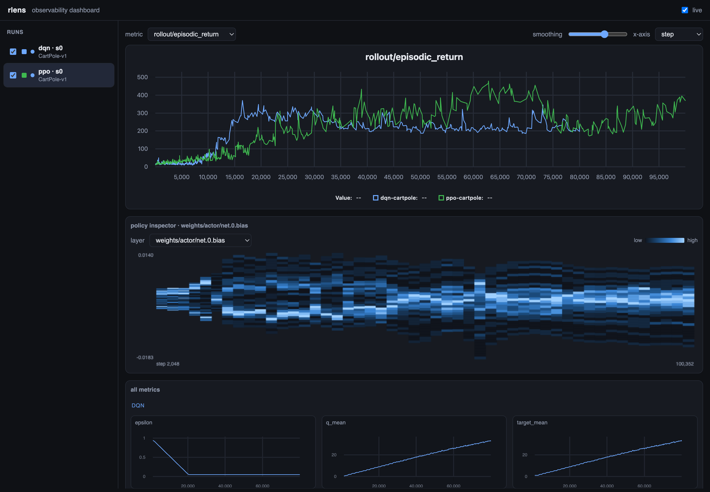

# rlens

[](https://github.com/can2erol/rlens/actions/workflows/ci.yml)
[](https://www.python.org/downloads/)
[](LICENSE)

**An observability-first reinforcement-learning library — see what your policy is doing, not
just its loss curve.**

rlens trains PPO, DQN and SAC on a single shared trainer and streams everything to a local
web dashboard: reward curves, per-layer gradient norms, action distributions, and rollout
video — live, while you train, overlaid across runs. Built on PyTorch and Gymnasium, designed
to run on a laptop (Apple Silicon / CPU, no CUDA required).



*The live dashboard — PPO and DQN runs overlaid on LunarLander-v3: reward curves, an
all-metrics grid (losses, gradient norms, eval, …), and a run-comparison table, updating
while you train.*

## Why rlens

- **See the policy, not just the loss.** A zero-setup dashboard with multi-run reward curves,
  gradient norms, action histograms, and inline rollout video — no W&B account, no TensorBoard
  process to babysit.
- **Benchmark & compare.** One command runs an (algorithm × env × seed) grid; a sortable
  comparison table and a config-diff view turn a sweep into a single glance.
- **Reproduced & trustworthy.** PPO/DQN/SAC match reference returns on standard envs
  ([benchmarks](benchmarks/)), and every run snapshots its config, library versions and git SHA.
- **Resumable & robust.** Full-state checkpoints, automatic best-policy saving, and crash-safe
  `--resume`.
- **One trainer, three algorithms.** Adding an algorithm means writing `act()` and `update()`;
  observability comes for free.

## Install

```bash
python3.12 -m venv .venv
source .venv/bin/activate
pip install -e ".[dev]"

# optional: Box2D envs (LunarLander, BipedalWalker) — needs a compiler/swig
pip install -e ".[dev,box2d]"
```

Requires Python 3.11+.

## Quickstart

```bash
# 1. train a policy (telemetry streams to ./runs/<run-name>)
rlens train --algo ppo --env CartPole-v1

# 2. in another terminal, watch it learn live
rlens dashboard                       # → http://127.0.0.1:8000

# 3. score the trained policy and record a rollout video
rlens eval runs/<run-name> --episodes 20 --video

# 4. run a benchmark grid, then summarize it as a table
rlens bench configs/bench.yaml --runs-dir runs
rlens report runs --episodes 20
```

## Dashboard

`rlens dashboard` serves a live, no-build web UI that *tails* run directories — attach to a
running job, a finished one, or a whole benchmark grid:

- A featured **reward curve** for any logged metric, **overlaying multiple runs**, with EMA
  **smoothing** and a **step ↔ wall-time** x-axis toggle.
- An **all-metrics grid** — every logged scalar at once (losses, KL, clipfrac, explained
  variance, per-layer gradient norms, eval curves, FPS), grouped by namespace and overlaid
  across runs. The smoothing and x-axis controls apply to the whole grid.
- A sortable **run-comparison table** (best/last return, eval score, steps, FPS, status).
- A **config panel** showing exactly which hyperparameters produced a curve — with a **diff
  mode** that highlights what changed across selected runs.
- Auto-captured **gradient norms**, **action distributions**, and inline **rollout video**.

It reads the same SQLite stores the trainer writes (WAL mode → safe concurrent reads), so the
dashboard is fully decoupled from training and adds no overhead to the hot loop.

## Benchmarks

rlens reproduces commonly reported reference returns. Full methodology, specs and per-seed
numbers are in [`benchmarks/`](benchmarks/); headline results (best policy, 3 seeds, CPU):

| algorithm | env | eval return | reference | status |
|-----------|-----|-------------|-----------|:---:|
| PPO | CartPole-v1 | 500.0 ± 0.0 | ≥ 475 (solved) | ✅ |
| DQN | CartPole-v1 | 500.0 ± 0.0 | ≥ 475 (solved) | ✅ |
| PPO | Acrobot-v1 | −86.4 ± 4.9 | ≥ −100 | ✅ |
| DQN | Acrobot-v1 | −81.1 ± 0.6 | ≥ −100 | ✅ |
| SAC | Pendulum-v1 | −131.4 ± 0.3 | ≥ −250 | ✅ |
| PPO | LunarLander-v3 | 229.9 ± 9.4 | ≥ 200 (solved) | ✅ |
| DQN | LunarLander-v3 | 251.5 ± 9.7 | ≥ 200 (solved) | ✅ |

Reproduce:

```bash
# classic control
rlens bench benchmarks/classic_control.yaml --runs-dir runs_bench
rlens report runs_bench --targets benchmarks/classic_control.yaml --best

# LunarLander (needs the box2d extra)
rlens bench benchmarks/lunarlander.yaml --runs-dir runs_lander
rlens report runs_lander --targets benchmarks/lunarlander.yaml --best
```

## Training & configuration

Set any hyperparameter from the command line with `--set key=value`. Algorithm knobs (`lr`,
`gamma`, `batch_size`, `hidden`, …) and run-level knobs (`num_envs`, `rollout_len`,
`learning_starts`, …) share one namespace and are type-checked against the config schema — an
unknown key fails immediately and lists the valid ones:

```bash
rlens train --algo sac --env Pendulum-v1 --set lr=3e-4 --set hidden=[256,256] --set tau=0.01
```

For repeatable runs, keep the config in YAML and override pieces on the command line:

```bash
rlens train --config configs/ppo_cartpole.yaml --steps 200000 --set lr=1e-3
```

Precedence is **defaults < `--config` < explicit flags < `--set`**. The fully-resolved config
(plus library versions and git SHA) is saved to each run's `run.json`.

## Evaluation & best policy

Training returns mix in exploration, so they undersell a policy. `rlens eval` loads a run and
scores it greedily:

```bash
rlens eval runs/<run-name>                   # mean ± std return over 10 episodes
rlens eval runs/<run-name> --episodes 20 --video
rlens eval runs/<run-name> --stochastic      # sample actions instead of greedy
rlens eval runs/<run-name> --best            # score the best-eval checkpoint
```

Pass `--eval-interval` to log a clean `eval/return_mean` curve *during* training (distinct from
the noisy `rollout/episodic_return`). When eval is enabled, training also saves
`best_policy.pt` — the highest-scoring policy, not just the last (RL often drifts after it
first solves a task):

```bash
rlens train --algo dqn --env CartPole-v1 --eval-interval 5000 --eval-episodes 10
```

## Checkpointing & resume

Every run writes a final checkpoint; `--checkpoint-interval` adds periodic ones. A checkpoint
captures the *full* training state — weights, optimizer momentum, target networks, counters and
RNG — so `--resume` continues exactly where it stopped instead of cold-starting:

```bash
rlens train --algo dqn --env CartPole-v1 --steps 500000 --checkpoint-interval 50000
rlens train --resume runs/<run-name>                 # finish the original budget
rlens train --resume runs/<run-name> --steps 1000000 # ...or extend it
```

The newest few checkpoints are kept (`checkpoint_keep`, default 3); `policy.pt` (weights only,
for `rlens eval`) is written separately.

## Off-policy throughput

DQN and SAC decouple **collection** from **updates**, so you can trade wall-clock against
sample-efficiency. The *replay ratio* (`gradient_steps / (update_every × num_envs)`) is what
matters; defaults match the classic one-update-per-step recipe, and lowering the ratio is
dramatically faster — often just as good when the default over-updates. On DQN/CartPole
(20k steps, CPU):

| `--num-envs` | `--update-every` | `--gradient-steps` | wall | eval return |
|:---:|:---:|:---:|:---:|:---:|
| 1 | 1 | 1 (default) | 9.4 s | 145.9 |
| 8 | 8 | 8 | 8.0 s | 169.1 |
| 8 | 4 | 1 | 2.3 s | 225.4 |
| 8 | 8 | 1 | **1.3 s** | 185.4 |

```bash
rlens train --algo sac --env Pendulum-v1 --num-envs 8 --update-every 8 --gradient-steps 2
```

## Image observations & Atari

Any env with a 3-D Box observation automatically gets a **Nature-CNN encoder** (Mnih et al.
2015) instead of an MLP. Images travel as **uint8** (the encoder normalizes), so replay memory
stays feasible, and channels-last frames are transposed to channel-first for you.

```bash
pip install -e ".[atari]"
rlens train --algo dqn --env ALE/Breakout-v5     # 84x84 grayscale, 4-frame stack, CNN
rlens train --algo ppo --env ALE/Pong-v5
```

Atari ids (`ALE/...`) get the standard 84×84 grayscale + frame-skip + 4-frame-stack pipeline;
DQN and PPO handle discrete-action image envs.

> Reaching published Atari *scores* needs ~10M frames and a GPU. On CPU/MPS the full pipeline
> runs and learns (verified end-to-end on a synthetic image task in the test suite), but
> reproducing benchmark scores is out of scope for laptop hardware.

## Algorithms

| Algorithm | Type | Action space | Observations |
|-----------|------|--------------|--------------|
| PPO | on-policy | discrete + continuous | vector + image |
| DQN | off-policy | discrete | vector + image |
| SAC | off-policy | continuous | vector |

All three share one trainer and one telemetry layer.

## Project layout

```
rlens/
  core/         device, seeding, envs, buffers, networks
  algos/        ppo, dqn, sac (+ base Algorithm)
  trainer.py    shared on-policy / off-policy loop
  telemetry/    recorder, SQLite store, gradient & frame/video capture
  experiment/   config, single-run, benchmark grid, eval, report
  dashboard/    FastAPI server + no-build static SPA
benchmarks/     reproducible benchmark specs + results
configs/        example train / benchmark configs
```

## Development

```bash
pip install -e ".[dev]"
ruff check rlens tests     # lint
pytest                     # full suite (CPU; ~1 min)
```

CI runs `ruff` + `pytest` on Python 3.11 and 3.12 for every push and pull request.

## Status

Early/alpha — the public API may still change. Issues and contributions are welcome.

## License

MIT — see [LICENSE](LICENSE). Bundles [uPlot](https://github.com/leeoniya/uPlot) (MIT); see
[THIRD_PARTY.md](THIRD_PARTY.md).
